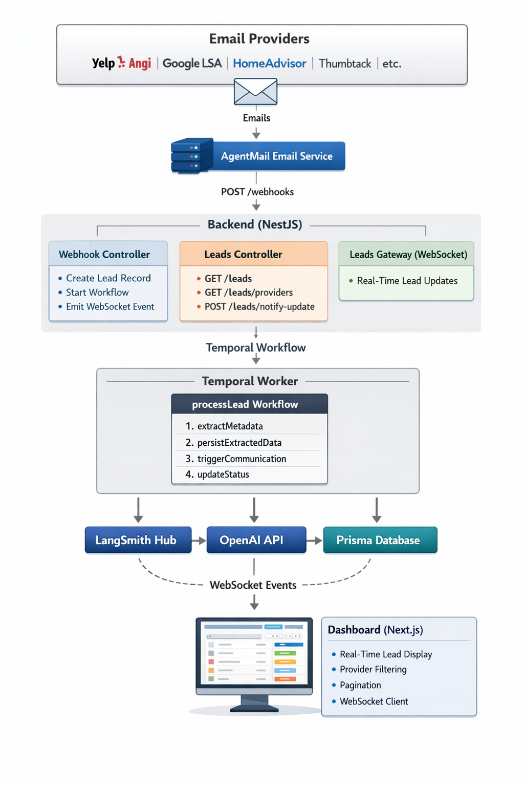

# Email Leads Agent

> Production-grade system for ingesting, extracting, and processing customer leads from email notifications using AI-powered extraction and Temporal workflows.

[](https://docs.smith.langchain.com/)
[](https://nestjs.com/)
[](https://zod.dev/)
[](https://temporal.io/)
[](https://nextjs.org/)
[](https://turbo.build/)

## Table of Contents

- [Overview](#overview)
- [Architecture](#architecture)
- [Setup and Installation](#setup-and-installation)
- [API Reference](#api-reference)
- [Workflow & Data Flow](#workflow--data-flow)
- [Configuration](#configuration)
- [Design Decisions](#design-decisions)
- [Comprehensive Email Research](#comprehensive-email-research)

## Overview

The Email Leads Agent automates the processing of customer leads received via email from lead generation providers (Yelp, Angi, Google LSA, HomeAdvisor, Thumbtack, etc.). The system extracts structured customer information using AI, stores it in a database, and triggers communication workflows—all without requiring direct API integrations from providers.

### Key Features

- **Real-time Email Ingestion**: Webhook-based email ingestion via AgentMail
- **AI-Powered Extraction**: LangChain + OpenAI for structured data extraction from unstructured emails
- **Workflow Orchestration**: Temporal workflows for reliable, retryable lead processing
- **Real-time Dashboard**: Next.js dashboard with WebSocket updates for live lead monitoring
- **Provider Detection**: Automatic detection of lead source from email metadata
- **Error Handling**: Comprehensive error handling with status tracking and alerts
- **Scalable Architecture**: Monorepo structure with separate backend, temporal, and dashboard apps

### Use Case

Many small lead generation providers don't offer direct API integrations but notify clients of new leads via email. This system:

1. Receives emails via webhook
2. Extracts customer information using AI
3. Stores the data in a database
4. Triggers communication workflows
5. Provides a dashboard for monitoring and management

---

## Architecture



The system architecture leverages LangSmith for prompt management and testing, enabling iterative development and optimization of the AI extraction pipeline.

For detailed information on architectural decisions and their rationale, see [Design Decisions](./docs/design-decisions.md).

---

## Setup and Installation

### Prerequisites

| Tool | Version | Purpose |
|------|---------|---------|
| **Node.js** | 18+ | Runtime environment |
| **npm** | Latest | Package manager |
| **Temporal Server** | Latest | Workflow orchestration |
| **AgentMail Account** | - | Email service |
| **OpenAI API Key** | - | AI extraction |
| **LangSmith Account** | - | Prompt management |

### Monorepo Setup

```bash
# Clone repository
git clone <repository-url>
cd agent-perry

# Install dependencies
npm install
```

### Backend Setup

```bash
cd apps/backend

# Install dependencies
npm install

# Set up environment variables
cp .env.example .env
# Edit .env with your configuration

# Run database migrations
npx prisma migrate dev

# Generate Prisma client
npx prisma generate

# Set up AgentMail webhook (runs automatically on start)
npm run setup

# Start backend
npm run dev
```

The backend will run on `http://localhost:3000` by default.

### Temporal Worker Setup

```bash
cd apps/temporal

# Install dependencies
npm install

# Ensure Temporal server is running
# Local: temporal server start-dev
# Or use Temporal Cloud

# Start worker
npm run dev
```

The worker will connect to Temporal at `localhost:7233` by default.

### Dashboard Setup

```bash
cd apps/dashboard

# Install dependencies
npm install

# Set up environment variables
cp .env.example .env.local
# Edit .env.local with backend URL

# Start dashboard
npm run dev
```

The dashboard will run on `http://localhost:3001` by default.


## API Reference

### Webhook Endpoints

#### `POST /webhooks`

Receives email notifications from AgentMail.

**Request Body** (Zod-validated):

```typescript
{
  event_id: string;
  event_type: "message.received";
  message: {
    message_id?: string;
    subject: string;
    text: string;
    extracted_text?: string;
    from: string;
    from_: string;
    inbox_id: string;
    organization_id?: string;
    timestamp?: string; // ISO 8601
  };
  thread?: {
    thread_id?: string;
    subject?: string;
  };
}
```

**Response**: `200 OK` (void)

**Behavior**:
1. Creates lead record in database with status "new"
2. Determines provider from email `from_` field
3. Stores essential raw email data (excludes large HTML)
4. Starts Temporal workflow for extraction
5. Emits WebSocket event `lead:created`
6. Returns immediately (async processing)

**Error Handling**:
- `400 Bad Request`: Invalid webhook payload
- Validation errors logged and returned

### REST API Endpoints

#### `GET /leads`

Fetches paginated leads with optional filtering.

**Query Parameters**:

| Parameter | Type | Required | Default | Description |
|-----------|------|----------|---------|-------------|
| `org_id` | string | No | - | Filter by organization ID |
| `provider` | string | No | - | Filter by provider name |
| `page` | number | No | 1 | Page number (1-indexed) |
| `limit` | number | No | 20 | Results per page |

**Example Request**:

```bash
GET /leads?provider=Yelp&page=1&limit=20
```

**Response**:

```typescript
{
  leads: Lead[];
  total: number;
  page: number;
  limit: number;
}
```

**Lead Object**:

```typescript
{
  id: number;
  customer_name: string | null;
  customer_number: string; // "pending-extraction" if not extracted
  customer_address: string | null;
  provider: string;
  provider_lead_id: string | null; // "not provided" if missing
  org_id: string;
  status: "new" | "processed" | "failed" | "pending";
  lead_raw_data: {
    event_id?: string;
    message?: {
      subject?: string;
      text?: string;
      from?: string;
    };
  };
  chat_channel: string | null;
  service_requested: string | null;
  workflow_id: string | null;
  lead_metadata: Record<string, unknown> | null;
  createdAt: string; // ISO 8601
  updatedAt: string; // ISO 8601
}
```

#### `GET /leads/providers`

Returns list of all unique providers in the database.

**Response**:

```typescript
string[] // e.g., ["Yelp", "Angi", "Google LSA", "Unknown"]
```

#### `POST /leads/notify-update`

Internal endpoint called by Temporal activities to notify of lead updates.

**Request Body**:

```typescript
{
  leadId: number;
}
```

**Response**: `200 OK` (void)

**Behavior**: Emits WebSocket event `lead:updated` for the specified lead.

### WebSocket Events

**Connection**: Connect to backend WebSocket server (same origin as REST API)

**Events Emitted by Server**:

| Event | Payload | Description |
|-------|---------|-------------|
| `lead:created` | `Lead` | Emitted when a new lead is created |
| `lead:updated` | `Lead` | Emitted when a lead is updated |

**Example Client Code**:

```typescript
import { io } from 'socket.io-client';

const socket = io('http://localhost:3000');

socket.on('lead:created', (lead: Lead) => {
  console.log('New lead:', lead);
});

socket.on('lead:updated', (lead: Lead) => {
  console.log('Lead updated:', lead);
});
```

### Communication Trigger Endpoint

The system triggers communication by sending a POST request to the `COMMS_WEBHOOK_URL` environment variable.

**Endpoint**: Configured via `COMMS_WEBHOOK_URL` environment variable

**Request**:

```typescript
POST <COMMS_WEBHOOK_URL>
Content-Type: application/json

{
  leadId: number;
  extractedData: {
    customer_name: string | null;
    customer_number: string | null;
    customer_address: string | null;
    service_requested: string | null;
    provider_lead_id: string | null;
    provider: string | null;
    lead_metadata: Record<string, unknown> | null;
  };
}
```

**Response**: Expected `200 OK` (any response is accepted, failures are logged but don't fail workflow)

**Behavior**:
- Called by Temporal `triggerCommunication` activity
- Non-blocking: failures are logged but don't fail the workflow
- Used to initiate SMS/call workflows in external communication service

---

## Workflow & Data Flow

### Temporal Workflow: `processLead`

**Trigger**: Started by backend when webhook is received

**Input**:

```typescript
{
  leadId: number;
  emailBody: string;
  emailSubject: string;
}
```

**Activities (Sequential)**:

| Activity | Description | Retry Policy |
|----------|-------------|--------------|
| `extractMetadata` | Fetches prompt from LangSmith Hub, calls OpenAI GPT, parses JSON response | 3 attempts, 1s initial interval |
| `persistExtractedData` | Updates lead record with extracted fields, stores metadata | 3 attempts, 1s initial interval |
| `triggerCommunication` | Sends POST to `COMMS_WEBHOOK_URL` | Non-blocking (failures logged) |
| `updateStatus` | Updates lead status to "processed" or "failed" | 3 attempts, 1s initial interval |

**Error Handling**:
- If any activity fails after retries, workflow updates status to "failed"
- Errors are logged with structured context
- Workflow throws `WorkflowError` with descriptive message

**Alerts**:
- Missing phone number: Logged as warning with `[ALERT]` prefix

### Lead Status Lifecycle

```
new → processing → processed
                ↓
              failed
```

| Status | Description |
|--------|-------------|
| `new` | Initial state when lead is created |
| `processing` | Implicit state during workflow execution |
| `processed` | Successfully extracted and communication triggered |
| `failed` | Workflow failed or extraction unsuccessful |

---

## Configuration

### Environment Variables

#### Backend (`apps/backend/.env`)

**Required**:

| Variable | Description | Example |
|----------|-------------|---------|
| `AGENTMAIL_API_KEY` | AgentMail API key | `your_agentmail_api_key` |
| `AGENTMAIL_WEBHOOK_URL` | Full URL for webhooks | `https://your-domain.com/webhooks` |
| `AGENTMAIL_INBOX_ID` or `AGENTMAIL_INBOX_DISPLAY_NAME` | Inbox identifier | `Lead Inbox` |
| `DATABASE_URL` | SQLite database path | `file:./dev.db` |
| `TEMPORAL_ADDRESS` | Temporal server address | `localhost:7233` |
| `TASK_QUEUE` | Temporal task queue name | `lead-processing` |

**Optional**:

| Variable | Description | Default |
|----------|-------------|---------|
| `PORT` | Backend server port | `3000` |
| `DASHBOARD_URL` | Dashboard URL for CORS | `http://localhost:3001` |
| `DEBUG` | Enable debug logging | `false` |

#### Temporal Worker (`apps/temporal/.env`)

**Required**:

| Variable | Description | Example |
|----------|-------------|---------|
| `LANGSMITH_API_KEY` | LangSmith API key | `your_langsmith_api_key` |
| `LANGSMITH_USERNAME` | LangSmith username | `your_username` |
| `LANGSMITH_PROMPT_NAME` | Prompt name in LangSmith Hub | `your-org/email-lead-extraction` |
| `OPENAI_API_KEY` | OpenAI API key | `your_openai_api_key` |
| `DATABASE_URL` | SQLite database path | `file:../backend/dev.db` |
| `TEMPORAL_ADDRESS` | Temporal server address | `localhost:7233` |
| `TASK_QUEUE` | Temporal task queue name | `lead-processing` |
| `BACKEND_URL` | Backend API URL | `http://localhost:3000` |

**Optional**:

| Variable | Description | Default |
|----------|-------------|---------|
| `COMMS_WEBHOOK_URL` | Communication service webhook URL | - (skipped if not set) |

#### Dashboard (`apps/dashboard/.env.local`)

**Required**:

| Variable | Description | Default |
|----------|-------------|---------|
| `NEXT_PUBLIC_API_URL` | Backend API URL | `http://localhost:3000` |

---

## Design Decisions

This system implements 20+ key architectural and implementation decisions focused on performance, security, reliability, and maintainability. These decisions cover:

- Environment variable configuration for deployment flexibility
- Temporal retry policies with timeout protection
- PII-aware logging strategies
- WebSocket architecture for real-time updates (97% reduction in server load)
- Optimized database storage (70-80% storage reduction)
- Layered provider detection (regex + LLM fallback)
- Workflow ID correlation for observability
- Server-side pagination (98% reduction in DOM nodes)
- Dynamic provider lists for data-driven UI
- Comprehensive error handling and propagation
- Input normalization and validation
- Zod contracts throughout the data flow
- Provider dashboard link integration (70% workflow efficiency improvement)
- Minimalist UI design principles
- Temporal determinism practices

For detailed technical rationale, performance metrics, and implementation details, see [Design Decisions](./docs/design-decisions.md).

---

## Email Research

We've conducted extensive research into lead generation email formats across major platforms. Our system has been tested against **23+ unique email variations** from:

  

Covering:
- Booking requests and appointment confirmations
- Phone call leads and missed call notifications
- Direct messages and quote requests
- Call back requests and time connection requests
- Lead activity summaries and opportunity notifications

For detailed sample email cases showing how different formats are normalized and extracted, see [Sample Lead Email Cases](./docs/sample-lead-emails.md).

### Format Variability Handling

Different lead providers send emails in completely different formats—HTML, plain text, rich text, with varying structures and styles. Our system handles this variability through a **normalization-first approach**:

**Normalization Strategy**:
- Extract email **subject** (always present)
- Extract plain **text** content (from HTML or provided as-is)
- Send normalized `subject` + `text` to LLM for extraction

**Why This Works**:
- **Format Agnostic**: HTML, plain text, or rich text—all reduced to subject + text
- **Provider Agnostic**: Google LSA, Yelp, Angi—consistent input regardless of source
- **Robust Fallback**: Uses `text` first, falls back to `extracted_text` if needed
- **Consistent Extraction**: LLM receives standardized format, improving accuracy

Regardless of email format variations, we successfully extract customer name, phone number, address, and service requested. The system monitors extraction success rates and handles edge cases gracefully.

> **Note**: This is not a comprehensive list. The system is designed to be extensible—new lead emails from different providers can be easily added. Prompts can be updated and tested in [LangSmith](https://smith.langchain.com/) without code changes, allowing rapid iteration and improvement of extraction accuracy for new email formats.